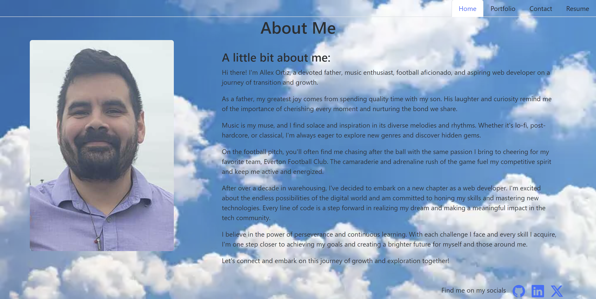
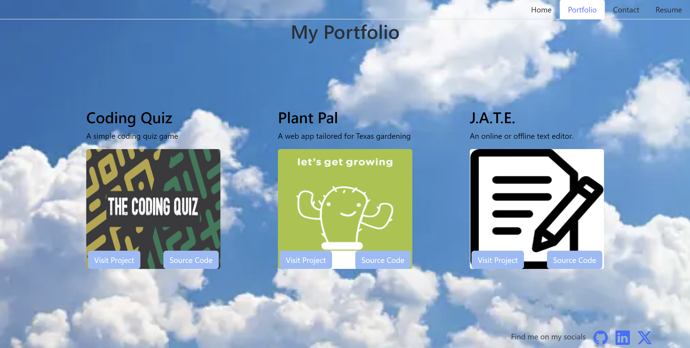
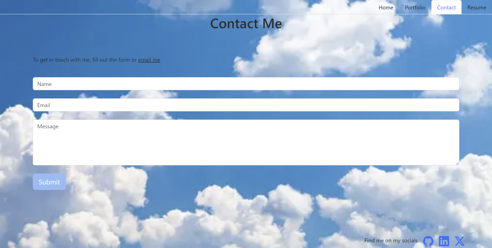
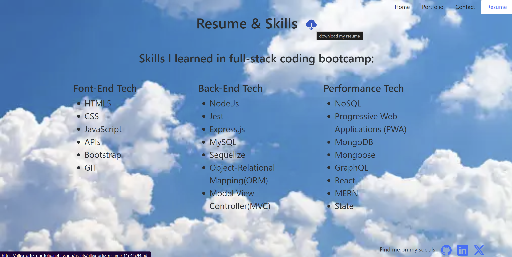

## React Portfolio

## User Story
```
AS AN employer looking for candidates with experience building single-page applications
I WANT to view a potential employee's deployed React portfolio of work samples
SO THAT I can assess whether they're a good candidate for an open position
```

## Acceptance Criteria
```
GIVEN a single-page application portfolio for a web developer
WHEN I load the portfolio
THEN I am presented with a page containing a header, a section for content, and a footer
WHEN I view the header
THEN I am presented with the developer's name and navigation with titles corresponding to different sections of the portfolio
WHEN I view the navigation titles
THEN I am presented with the titles About Me, Portfolio, Contact, and Resume, and the title corresponding to the current section is highlighted
WHEN I click on a navigation title
THEN the browser URL changes and I am presented with the corresponding section below the navigation and that title is highlighted
WHEN I load the portfolio the first time
THEN the About Me title and section are selected by default
WHEN I am presented with the About Me section
THEN I see a recent photo or avatar of the developer and a short bio about them
WHEN I am presented with the Portfolio section
THEN I see titled images of six of the developer’s applications with links to both the deployed applications and the corresponding GitHub repositories
WHEN I am presented with the Contact section
THEN I see a contact form with fields for a name, an email address, and a message
WHEN I move my cursor out of one of the form fields without entering text
THEN I receive a notification that this field is required
WHEN I enter text into the email address field
THEN I receive a notification if I have entered an invalid email address
WHEN I am presented with the Resume section
THEN I see a link to a downloadable resume and a list of the developer’s proficiencies
WHEN I view the footer
THEN I am presented with text or icon links to the developer’s GitHub and LinkedIn profiles, and their profile on a third platform (Stack Overflow, Twitter)
```

## Table of Contents
- [Description](#description)
- [Technologies](#technologies)
- [Links](#links)
- [Installation](#installation)
- [Images](#images)
- [Contributing](#contributing)
- [Questions](#questions)

## Description
I've developed a portfolio, that can be viewed on laptops and mobile devices, using REACT and Bootstrap CSS, designed to showcase my recent projects and provide a convenient contact form for reaching out to me.

## Technologies
 - Github
 - VS Code
 - Netlify
 - Axios
 - Bootstrap
 - React
 - React DOM
 - Vite

## Links
- [Github Repo](https://github.com/allexortiz/react-portfolio)
- [My Portfolio](https://allex-ortiz-portfolio.netlify.app/)

## Installation
Fork this repo, `git clone` to copy this to your local drive and open in VS Code. Open the intergrated terminal and run `npm i` and then `npm start` to launch the server.

## Images
Homepage


Portfolio


Contact


Resume


## Contributing
- Alex Lizarraga - Instructor
- Dustin Burns - TA
- Dennis Itus - Tutor

## Questions
If you have any addition questions feel free to reach me at either my github or email address.
- [GitHub](https://github.com/allexortiz)
- [Email](allex.ortiz@outlook.com)